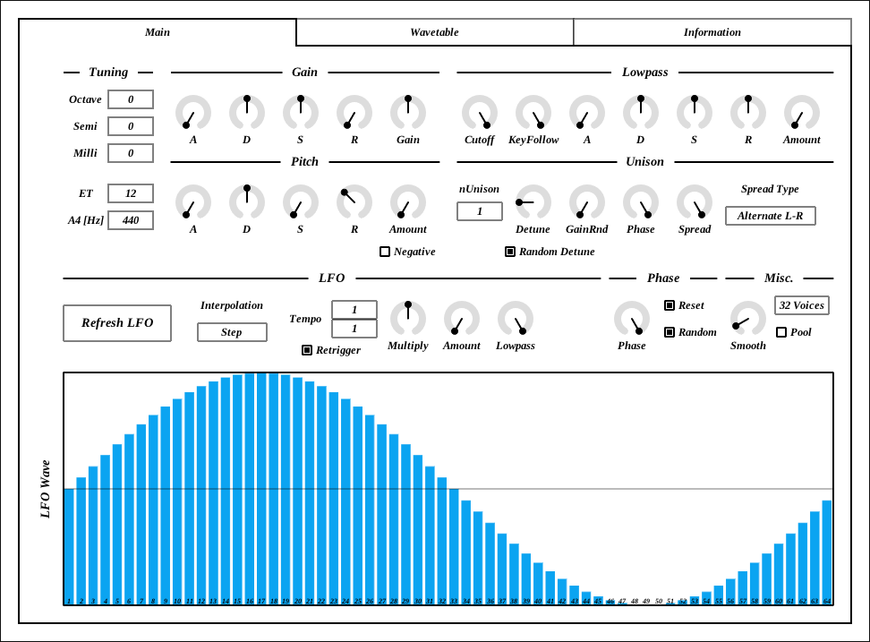
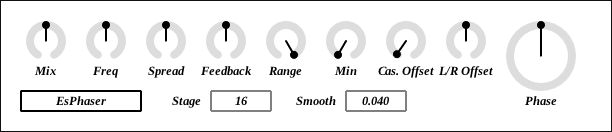
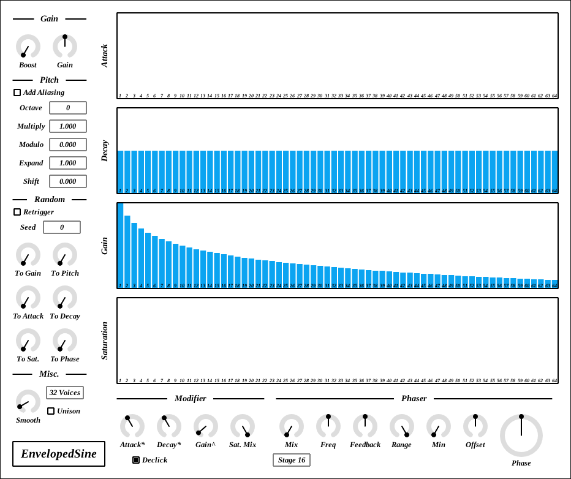
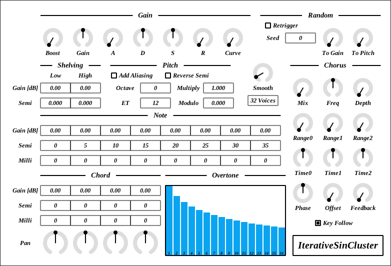
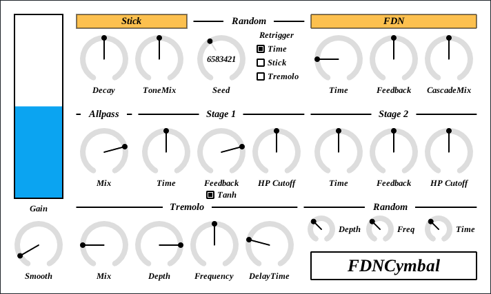
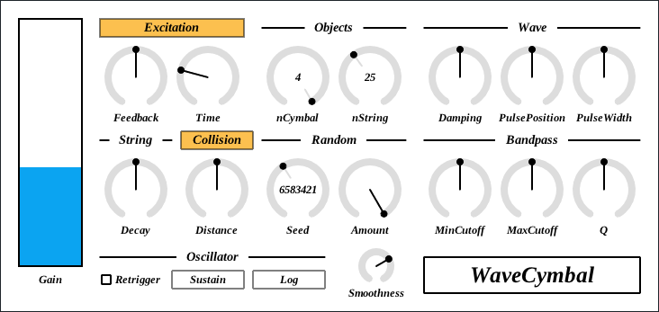
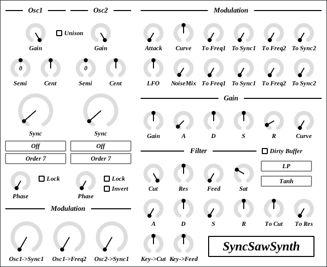
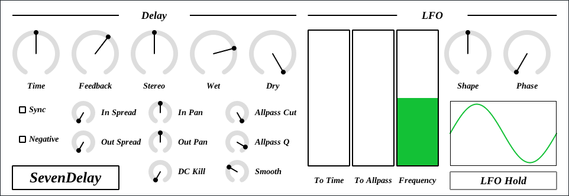

# LV2Plugins
Audio plugins for Linux.

VST3 version is available at https://github.com/ryukau/VSTPlugins .

# Building
On Ubuntu 18.04, open terminal and run following command.

```bash
sudo apt install git pkg-config libjack-jackd2-dev libgl-dev liblo-dev
git clone --recursive <this repository url>
cd LV2Plugins

# Temporary patch to DPF. See: https://github.com/DISTRHO/DPF/issues/216
cp patch/NanoVG.cpp lib/DPF/dgl/src/NanoVG.cpp

make -j
make install # Copy *.lv2 to ~/.lv2
```

Binaries are built into `LV2Plugins/bin`.

To rebuild, use `make clean` or `make cleanall`.

```bash
cd LV2Plugins
make clean    # Removes LV2Plugins/bin directory.
make cleanall # Removes LV2Plugins/bin and files built for DPF.
```

# Plugins
Note that some parameter configuration leads to massive DC offset. To stay safe, it's better to insert high-pass filter after these plugins. Monitoring output with oscilloscope is recommended.

Some controls turns red when pointing. They can be the cause of potential blow up. It is recommended to always change those controls slowly with <kbd>Shift</kbd> + <kbd>Mouse Left Drag</kbd>.

## CubicPadSynth
<figure>

</figure>

CubicPadSynth is a wavetable synthesizer which uses PADsynth algorithm to generate oscillator tables. Cubic interpolation is used to get smooth sound even at inaudible low frequency range. LFO waveform can be directly drawn.

- [PADsynth algorithm](https://zynaddsubfx.sourceforge.io/doc/PADsynth/PADsynth.htm)

Some parameters have wide range of value. <kbd>Shift</kbd> + <kbd>Left Drag</kbd> can be used to fine adjustment.

Barbox controls used for `LFO Wave` in Main tab and `Gain`, `Width`, `Pitch`, `Phase` in Wavetable tab have keyboard shortcuts. Shortcuts are only enabled when cursor is on overtone control. Cheat sheet is available on Information tab.

| Input                                   | Control                                 |
| --------------------------------------- | --------------------------------------- |
| <kbd>Ctrl</kbd> + <kbd>Left Click</kbd> | Reset to Default                        |
| <kbd>Right Drag</kbd>                   | Draw Line                               |
| <kbd>d</kbd>                            | Reset Everything to Default             |
| <kbd>D</kbd>                            | Toggle Min/Mid/Max                      |
| <kbd>e</kbd>                            | Emphasize Low                           |
| <kbd>E</kbd>                            | Emphasize High                          |
| <kbd>f</kbd>                            | Low-pass Filter                         |
| <kbd>F</kbd>                            | High-pass Filter                        |
| <kbd>i</kbd>                            | Invert Value (Preserve current minimum) |
| <kbd>I</kbd>                            | Invert Value (Minimum to 0)             |
| <kbd>n</kbd>                            | Normalize (Preserve current minimum)    |
| <kbd>N</kbd>                            | Normalize (Minimum to 0)                |
| <kbd>p</kbd>                            | Permute                                 |
| <kbd>r</kbd>                            | Randomize                               |
| <kbd>R</kbd>                            | Sparse Randomize                        |
| <kbd>s</kbd>                            | Sort Descending Order                   |
| <kbd>S</kbd>                            | Sort Ascending Order                    |
| <kbd>t</kbd>                            | Subtle Randomize                        |
| <kbd>,</kbd> (Comma)                    | Rotate Back                             |
| <kbd>.</kbd> (Period)                   | Rotate Forward                          |
| <kbd>1</kbd>                            | Decrease                                |
| <kbd>2</kbd>-<kbd>9</kbd>               | Decrease 2n-9n                          |

## EsPhaser
<figure>

</figure>

EsPhaser is a phaser with up to 4096 stages of order 2 Thiran all-pass filters. This is the same phaser used in EnvelopedSine.

Caution:
- When `stage` is set to 4096, it will be CPU intensive.
- Output varies in different sample rate.
- Output may be loud when changing `Cas. Offset`. Use <kbd>Shift</kbd> + <kbd>Mouse Left Drag</kbd> to slowly change the value, or insert limiter to prevent hard clipping.

## EnvelopedSine
<figure>

</figure>

EnvelopedSine is another additive synthesizer which computes 64 sine waves per note. There are individual controls of attack, decay and saturation for each sine oscillator.

Overtone controls (`Attack`, `Decay`, `Gain`, `Saturation`) have keyboard shortcuts. Shortcuts are only enabled when cursor is on overtone control. Cheat sheet can be popped up by clicking plugin title on bottom left.

| Input                                   | Control                                 |
| --------------------------------------- | --------------------------------------- |
| <kbd>Ctrl</kbd> + <kbd>Left Click</kbd> | Reset to Default                        |
| <kbd>Right Drag</kbd>                   | Draw Line                               |
| <kbd>a</kbd>                            | Sort Ascending Order                    |
| <kbd>d</kbd>                            | Sort Descending Order                   |
| <kbd>f</kbd>                            | Low-pass Filter                         |
| <kbd>F</kbd>                            | High-pass Filter                        |
| <kbd>i</kbd>                            | Invert Value (Preserve current minimum) |
| <kbd>I</kbd>                            | Invert Value (Minimum to 0)             |
| <kbd>n</kbd>                            | Normalize (Preserve current minimum)    |
| <kbd>N</kbd>                            | Normalize (Minimum to 0)                |
| <kbd>h</kbd>                            | Emphasize High                          |
| <kbd>l</kbd>                            | Emphasize Low                           |
| <kbd>p</kbd>                            | Permute                                 |
| <kbd>r</kbd>                            | Randomize                               |
| <kbd>R</kbd>                            | Sparse Randomize                        |
| <kbd>s</kbd>                            | Subtle Randomize                        |
| <kbd>,</kbd> (Comma)                    | Rotate Back                             |
| <kbd>.</kbd> (Period)                   | Rotate Forward                          |
| <kbd>1</kbd>                            | Decrease Odd                            |
| <kbd>2</kbd>-<kbd>9</kbd>               | Decrease 2n-9n                          |

EnvelopedSine uses stable quadrature oscillator (QuadOsc) algorithm described by Martin Vicanek. QuadOsc is used because I have no idea how to set initial phase for faster algorithm.

- [QuadOsc.pdf](https://www.vicanek.de/articles/QuadOsc.pdf)

Order 2 Thiran all-pass filters are used for phaser.

- [Thiran Allpass Interpolators](https://ccrma.stanford.edu/~jos/pasp/Thiran_Allpass_Interpolators.html)

## IterativeSinCluster
<figure>

</figure>

IterativeSinCluster is an additive synthesizer. This synth computes 512 sine waves for each note to make tone cluster. I somehow thought "iterative sin" was a thing, but the correct term is "recursive sine".

For number display used for `Gain`, `Semi`, etc. <kbd>Mouse Right Click</kbd> can be use to flip min/max.

For overtone control, <kbd>Mouse Right Drag</kbd> to set value to min, and <kbd>Ctrl</kbd> + <kbd>Mouse Right Drag</kbd> to set value to max.

Overview of calculation of pitch for each sine wave. Parameter `ET` stands for equal temperament. `Milli` means 1 milli semitone = 1 / 10 cent.

```
function toneToPitch(semi, milli):
  return 2 ^ (1000 * semi + milli) / (ET * 1000)

for each Chord:
  chordPitch = toneToPitch(Chord.semi, Chord.milli)
  for each Note:
    notePitch = toneToPitch(Note.semi, Note.milli)
    for each Overtone:
      frequency = midiNoteFrequency
        * (1 + mod(Multiply * Overtone * notePitch * chordPitch, Modulo))
```

Various recursive sin algorithm described by Martin Vicanek. IterativeSinCluster uses biquad oscillator.

- [QuadOsc.pdf](https://www.vicanek.de/articles/QuadOsc.pdf)

## TrapezoidSynth
<figure>

</figure>

TrapezoidSynth is a monophonic synthesizer equipped with trapezoid oscillator which is made from 5th order PTR ramp function. In other words, it's just a fancy version of tri-pulse oscillator. 2 pitch shifters are added to make some chord.

PTR trapezoid oscillator algorithm.

- [PTR 台形オシレータ](https://ryukau.github.io/filter_notes/ptr_trapezoid/ptr_trapezoid.html)

AM pitch shifter algorithm described by Scott Wardle.

- [WAR19 - Audio_Hilbert_WAR19.pdf](https://www.mikrocontroller.net/attachment/33905/Audio_Hilbert_WAR19.pdf)

IIR Hilbert filter by Olli Niemitalo. This filter is used in AM pitch shifter to approximate Hilbert transform.

- [Hilbert transform – iki.fi/o](http://yehar.com/blog/?p=368)

## FDNCymbal
<figure>

</figure>

FDNCymbal is another attempt to make cymbal sounds. This one at least sounds like hitting a metal plate. Unlike the name, most of metalic texture comes from stage 1 of [Schroeder allpass section](https://ccrma.stanford.edu/~jos/pasp/Schroeder_Allpass_Sections.html) rather than [FDN](https://ccrma.stanford.edu/~jos/cfdn/Feedback_Delay_Networks.html) (feedback delay network). FDN section makes nice impact sound when `FDN->Time` is short. Tremolo is added to simulate wobbling of cymbal.

FDNCymbal can be used as both synth/effect. To turn off oscillator, click `Stick` button.

Caution:
- When HP Cutoff is moving fast, it may output massive DC. To avoid this, use <kbd>Shift</kbd> + <kbd>Mouse Left Drag</kbd> or turn up `Smooth`.
- When FDN->Feedback is non zero, it may possibly blow up. If that happens, turn `FDN->Feedback` to leftmost.

JavaScript version is available. Requires browser that supports Web Worker and Web Audio. This is not exactly the same as plugin version, but using similar structure.

- [FDNCymbal](https://ryukau.github.io/FDNCymbal/)

## WaveCymbal
<figure>

</figure>

WaveCymbal is a banded wave-guide synthesizer. This is an attempt to make cymbal sounds, but result is more like dragging bunch of empty cans on asphalt. Be cautious tweaking controls that turns red when pointing. They can drastically change output gain.

WaveCymbal can be used as a effect. To turn off oscillator, change `Oscillator->Sustain` to `Off`.

Block diagram of WaveCymbal. BP is short for Band-pass.

<figure>

</figure>

JavaScript version is available. Requires browser that supports Web Worker and Web Audio.

- [WaveCymbal Demo](https://ryukau.github.io/WaveCymbal/)

The idea of banded wave-guide is based on Figure 4 in this paper.

- Essl, Georg, et al. "[Theory of banded waveguides.](https://cpb-us-w2.wpmucdn.com/sites.uwm.edu/dist/0/236/files/2016/09/CMJ04-theory-2ib3uzx.pdf)" Computer Music Journal 28.1 (2004): 37-50.

## SyncSawSynth
<figure>

</figure>

SyncSawSynth is a synthesizer with up to 10th order PTR sawtooth oscillator. PTR (Polynomial Transition Regions) is an aliasing suppressing technique.

PTR paper by Kleimola and Valimaki.

- Jari Kleimola, and Vesa Valimaki. “[Reducing aliasing from synthetic audio signals using polynomial transition regions.](https://aaltodoc.aalto.fi/bitstream/handle/123456789/7747/publication6.pdf?sequence=9&isAllowed=y)” IEEE Signal Processing Letters 19.2 (2011): 67-70.

Derivation of higher order PTR equations (Japanese).

- [PTR オシレータ](https://ryukau.github.io/filter_notes/ptr_oscillator/ptr_oscillator.html)

## SevenDelay
<figure>

</figure>

SevenDelay is using 7th order lagrange fractional delay. Also 7 times oversampled. Suitable for making sound with actively changing parameters by hand or DAW automation. Parameters are tuned towards short delay.

Lagrange FD explained by Julius O. Smith III. PDFs at the bottom of the page is better formatted.

- [MUS420 Lecture 4A Interpolated Delay Lines, Ideal Bandlimited Interpolation, and Fractional Delay Filter Design](https://ccrma.stanford.edu/~jos/Interpolation/)

Implementation of delay (Japanese).

- [ディレイの実装](https://ryukau.github.io/filter_notes/delay/delay.html)

## Other Notice
Plugins using filter from:
- [RBJ Audio-EQ-Cookbook — Musicdsp.org documentation](https://www.musicdsp.org/en/latest/Filters/197-rbj-audio-eq-cookbook.html)
- [Book: The Art of VA Filter Design 2.1.0 - KVR Audio](https://www.kvraudio.com/forum/viewtopic.php?t=350246)

# License
GPLv3. See License directory for the complete license.

## Library
- [DPF - DISTRHO Plugin Framework](https://github.com/DISTRHO/DPF)
- [juce_FastMathApproximations.h](https://github.com/WeAreROLI/JUCE/blob/master/modules/juce_dsp/maths/juce_FastMathApproximations.h) from [JUCE](https://juce.com/)
- [VCL - Vector class library version2](https://github.com/vectorclass/version2)

## Font
- [Tinos](https://fonts.google.com/specimen/Tinos)
