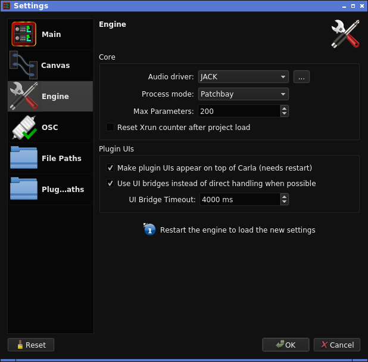
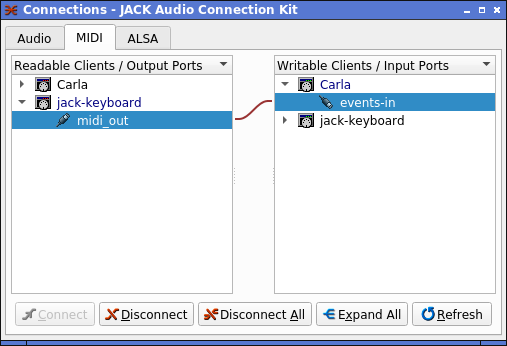
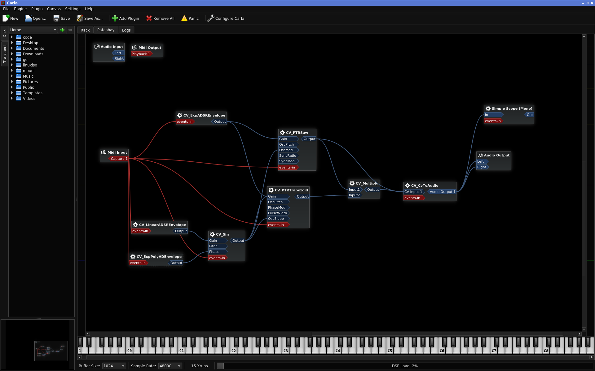

# LV2 CVPort Plugins
These plugins are made to test some algorithms. Parameter are tuned to be wide as possible, which may not be suitable for music.

If you have suggestion for parameter tuning or other things, feel free to open issue.

## CV_3PoleLP
3-pole low-pass filter.

`DC Block` and `Highpass` shares same parameter with different tuning. DC stands for direct current. Both parameters are multiplied into one value.

```
internalCutoffCoefficient = dcBlock * mapHzToCutoff(highpass)
```

When `UniformPeak` is checked, output gain will be almost uniform with varying `Resonance` value. "Almost" means that tuning curve is not exact but approximated.

When `UniformGain` is checked, output gain will be almost uniform with varying `Cutoff` value.

## CV_AudioToCv
Convert audio port signal to CV port signal.

## CV_CvToAudio
Convert CV port signal to audio port signal.

## CV_DoubleFilter
Strange 4-pole filter inspired from double-spring.

CV_DoubleFilter may outputs loud signal. Recommend to use with limiter.

When `Uniform Gain` is unchecked, output may be loud where `cutoff` is greater than 3800 Hz.

When `Highpass` is checked, `Uniform Gain` only makes subtle difference.

A CV signal will be added to the corresponding parameter.

### Tips
There is a resonance boundary around `cutoff` frequency 3700-3800 Hz depending on sample rate.

Resonance also appears when the value of `resonance` is close to 0. Try 0.01 or lower.

## CV_ExpADSREnvelope
Exponential ADSR Envelope.

## CV_ExpLoopEnvelope
Exponential curve envelope with 8 sections for loop.

### Loop and Trigger/Gate
`Loop Start` and `Loop End` sets the section to start/end loop. Number 8 is the same as `R` (release) section.

If `Loop End` is set to 8, incoming MIDI note or Trig/Gate signal behaves as trigger. When the envelope is triggered, the output will be entire envelope section without loop or sustain.

If `Loop End` is less than 8, incoming MIDI note or Trig/Gate signal behaves as gate. When the envelope is gated, the output loops between the sections from `Loop Start` and `Loop End`.

To sustain, set `Loop End` to less than or equal to `Loop Start`. For example, if both are set to 4, the envelope sustains at section 4 `Level`.

### Rate Control
`Rate` parameter changes the frequency of the envelope. The value of `Rate` will be multiplied to the value of `Decay*` and `Hold*` to shorten/lengthen the time.

CV input of `Rate` will be mapped by following expression:

```
rate = rateUI + powf(2.0, rateCV * 32.0 / 12.0)
```

When `Rate Key Follow` is checked, MIDI note modifies `Rate`. So it can be played as musical tone. In this case, `Rate` represents the frequency at A4. Due to being envelope, it's most likely that pitch tuning will not match the frequency set by `Rate`.

### Decay, Hold, Level
CV inputs of `Decay` and `Hold` will be full wave rectified by `fabsf`. Then added to the value set on GUI.

CV inputs of `Level` will be simply added.

## CV_ExpPolyADEnvelope
Exponential polynomial envelope. Note that this envelope resets to 0 for each note-on.

Beware that increasing `curve` parameter may lead to very loud output.

## CV_Gate16
16 CV trigger/gate/DC signal generator.

`Type` behavior:

- `Trigger`: Outputs impulse at MIDI note-on.
- `Gate`: Outputs gate signal while at least 1 MIDI note is on.
- `Direct Current`: Outputs DC signal. Ignores MIDI notes.

## CV_HoldFilter
Step decimator combined with resonance filter. Using PolyBLEP residual to reduce aliasing noise.

`Cutoff [Hz]` is not really a cutoff frequency, but a frequency to sample and hold (S&H) input signal.

`PulseWidth` does not change duty ratio. CV_HoldFilter internally holds 2 S&H intervals and `PulseWidth` changes the ratio of those intervals.

`Edge` adds impulse like edge at rise and fall of output signal. When `Edge` is set to 1.0, it will not add any edge. When `Edge` is not set to 1.0, PolyBLEP aliasing suppression will gradually stop working.

`FilterType` changes order of PolyBLEP aliasing suppression. `Naive` does no aliasing suppression. `PolyBLEP N` suppress aliasing noise where larger `N` for better suppression.

## CV_Invert
Invert sign of signal. For example, amplitude +1 becomes -1 after passing through CV_Invert.

## CV_LinearADSREnvelope
Linear ADSR envelope. 1 event input and 1 CV output.

## CV_LinearMap
Maps value as following equation:

```
Output = Add + Mul * Input.
```

## CV_Multiply
Multiply CV signal. 2 CV inputs and 1 CV output.

## CV_ParabolicADEnvelope
Parabolic envelope. Note that this envelope resets to 0 for each note-on.

## CV_PController
Slew limiter based on PID controller without I and D. This is basically an 1-pole lowpass filter.

Transfer function.

```
H(z) = kp / (1 + (kp - 1) * z^-1)
```

Using exact formula to compute cutoff frequency.

```
ω_c = 2 * pi * cutoffHz / sampleRate
y   = 1 - cos(ω_c)
kp  = -y + sqrt((y + 2) * y)
```

This formula is described in the link below.

- [Single-pole IIR low-pass filter - which is the correct formula for the decay coefficient? - Signal Processing Stack Exchange](https://dsp.stackexchange.com/questions/54086/single-pole-iir-low-pass-filter-which-is-the-correct-formula-for-the-decay-coe)

## CV_PTRSaw
Monophonic order 10 PTR sawtooth oscillator. Double precision is used internally.

### CV Mapping
Equation to calculate gain value:

```
gain = paramGain * paramBoost + cvGain
```

OscPitch and SyncPitch equations:

```
oscFreq  = noteFreq * pow(2.0f, cvOscPitch * 32.0f / 12.0f)
syncFreq = oscFreq * cvSyncPitch
```

OscMod and SyncMod are added to phase.

```
phase += frequency / sampleRate + cvMod
phase -= floor(phase)
```

## CV_PTRTrapezoid
Monophonic PTR trapezoid oscillator. Double precision is used internally. PTRTrapezoid changes PTR order according to current frequency.

### CV Mapping
Equation to calculate gain value:

```
gain = paramGain * paramBoost + cvGain
```

Equation to convert from OscPitch CV to frequency:

```
oscFreq = noteFreq * pow(2.0f, cvPitch * 32.0f / 12.0f)
```

PhaseMod is added to oscillator phase.

```
phase += frequency / sampleRate + cvPhaseMod
phase -= floor(phase)
```

Input to PulseWidth should be in range of `[-1, 1]`. Excessed range will be hard clipped.

OscSlope will be multiplied by the value of `slope` parameter.

## CV_RampFilter
Ramp decimator combined with resonance filter.

`Cutoff [Hz]` is not really a cutoff frequency, but a frequency to S&H input signal.

`RampLimit` sets maximum slope to prevent blow up. Because of `RampLimit`, CV_RampFilter will never diverge, but oscillates in worst case. Unit is amplitude/sample.

`Bias` sets character of resonance by changing the ratio between rising rate and falling rate. `Bias` is discontinuous at ±0.75.

`BiasTuning` extends bias to get more resonance.

## CV_RateLimiter
Slew rate limiter.

CV_RateLimiter is an implementation of Rate Limiter described in the link below.

- [Limit rate of change of signal - Simulink](https://www.mathworks.com/help/simulink/slref/ratelimiter.html)

## CV_Sin
Monophonic sine oscillator.

### CV Mapping
Equation to calculate gain value:

```
gain = paramGain * paramBoost + cvGain
```

Equation to convert from Pitch CV to frequency:

```
oscFreq = noteFreq * pow(2.0f, cvPitch * 32.0f / 12.0f)`
```

Phase CV is added to sine phase for each sample.

```
phase = fmodf(phase + twopi * freq / sampleRate + cvPhase, twopi);
return sinf(phase);
```

# Quick Setup
First, install `qjackctl`, `jack-keyboard`, `a2jmidid` and `Carla`.

If your environment has multiple sound device, it may requires to configure `qjackctl`. In this case, click `Setup` buttion. Then open `Settings` -> `Advanced` tab. `Output Device` and `Input Device` may not be set to primary device, so fix it.

When configuration is done, click `Start` button on main window of `qjackctl` to start `jackd`.

To enable MIDI keyboard, `a2jmidid` can be used to receive notes. To start `a2jmidid`, type following command after started `jackd` via `qjackctl`.

```
a2jmidid -e
```

If you don't have MIDI keyboard, `jack-keyboard` can be used.

`Carla` also requires some configuration to use LV2 CV port. Click `Configure Carla`, then go to `Engine` tab. Change `Audio driver` to JACK and `Process mode` to Patchbay. After configuration, quit Carla, start `jackd` via `qjackctl`, then restart `Carla`. `Carla` now loads LV2 CV port plugins.

<figure>

</figure>

JACK application have to be manually connected. Click `Connect` button on main window of `qjackctl`, then use drag and drop to connect applications to appropriate port.

<figure>

</figure>

<figure>

</figure>

`qjackctl` can save current connection as a session. Click `Session` buttion on main window of `qjackctl`, then click `Save`.

For more detailed information, take a look at ArchWiki.

- [JACK Audio Connection Kit - ArchWiki](https://wiki.archlinux.org/index.php/JACK_Audio_Connection_Kit)
- [Professional audio - ArchWiki](https://wiki.archlinux.org/index.php/Professional_audio)

Example patch in Carla.

<figure>

</figure>
